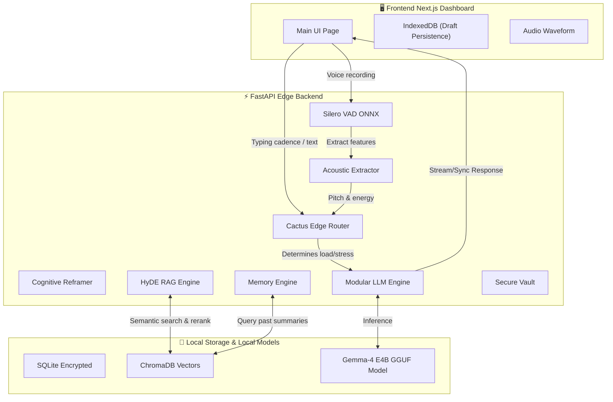

# 🌿 Sanctuary 3.0 — The Edge-Native Socratic CBT Core

> **Instant, Private, Clinical-Grade CBT Reasoning — Powered by Gemma 4.**

Sanctuary 3.0 is a production-hardened, zero-telemetry mental health journaling platform that brings high-fidelity therapeutic support to the edge. Built for the privacy-conscious user, Sanctuary processes everything—from voice transcriptions to clinical reasoning—100% locally on your device. No API keys. No cloud calls. No data leaks. 

It marries advanced cognitive computing architectures with state-of-the-art multimodal biometrics and strict user-privacy protocols to deliver clinical-grade therapeutic interactions completely on the edge.

---

## 🏗️ High-Level System Architecture

Sanctuary operates on a strict **decentralized, local-first hybrid architecture**. The frontend client collects typing biometrics and voice streams, while the FastAPI edge backend performs lightweight local heuristics, runs voice activity detection, performs semantic vector database searches, and operates a quantized local LLM for CBT reasoning.



---

## 🚀 Key Innovations & Features

### 1. Zero-Telemetry Architecture
No API keys. No cloud processing. No data leaks. Sanctuary uses an optimized, fine-tuned **Gemma 4 E4B** model for local inference via `llama-cpp-python`, achieving high throughput directly on a CPU with a lightweight **2.49 GB** model footprint.

### 2. Dynamic Multimodal Biometric Routing
The **Cactus Edge Router** analyzes real-time biometrics from the client device to ascertain the user's cognitive/stress state before passing context to the LLM:
*   **Text Complexity:** Analyzes word count to gauge expressive detailing.
*   **Typing Cadence:** Tracks physical keystroke intervals. High latency/hesitation flags cognitive load or anxiety.
*   **Acoustic Biomarkers:** Vocal Pitch and Sound Energy are extracted via `librosa` to map to potential depressive states or anxiety.

### 3. Socratic CBT Reasoning Engine & Reframing
Unlike generic LLMs that provide plain advice, Sanctuary is strictly hardcoded for **Socratic Reframing**:
*   **Identifying Cognitive Distortions:** The Reframer maps linguistic indicators to 6 main patterns of cognitive distortion (e.g., *Catastrophizing*, *Emotional Reasoning*, *All-or-Nothing Thinking*).
*   **Chain-of-Thought Filtering:** The model reasons about specific distortions internally before generating a Socratic response. An on-the-fly streaming token buffer intercepts and strips these metadata headers, delivering only the pristine therapeutic response to the user interface.

### 4. Semantic RAG & Double-Loop Memory
*   **HyDE-RAG (Hypothetical Document Embeddings):** Our retrieve-and-reason engine generates a hypothetical clinical response to construct intent before querying our **ChromaDB** clinical protocol vault.
*   **Cross-Encoder Reranking:** Raw candidates are scored and reordered via a lightweight local Cross-Encoder (`ms-marco-MiniLM-L-6-v2`) to prioritize relevant protocols.
*   **Long-Term Memories Integration:** Vectorizes clinical themes over time to inject into the LLM system instructions during subsequent sessions for longitudinal continuity.

### 5. Premium Glassmorphic UX
A Spotify-inspired glassmorphic UI built with **Next.js 16** and **Tailwind CSS v4** featuring:
*   **IndexedDB Persistence:** Offline draft caching with zero cloud dependency.
*   **Audio Visualizer:** Real-time canvas-based frequency analysis for voice sessions.
*   **Encrypted Vault:** Provides physical edge diagnostics like live log stream updates and security confirmations.

---

## 🛠️ Technical Stack

| Layer | Technology | Core Responsibility |
| :--- | :--- | :--- |
| **ML Core** | Gemma 4 E4B (Unsloth rsLoRA) | Edge LLM inference (quantized `q8_0` GGUF). |
| **Vector DB** | ChromaDB + Cross-Encoder | Grounding query vector retrieval containing clinical protocols. |
| **Audio** | Silero VAD (ONNX) + Whisper | Local speech detection and transcription. |
| **Frontend** | Next.js 16, Framer Motion, Lucide | Fluid, high-fidelity React application with dynamic layouts. |
| **Backend** | FastAPI, AnyIO, Cryptography | Coordinates REST/SSE endpoints; orchestrates streaming pipelines. |
| **Storage** | SQLite + AES-256 GCM | Authenticated encryption for chat history and sessions. |

---

## 📖 How To Run Sanctuary (3 Ways)

We provide three different ways to experience Sanctuary. Choose the one that works best for you!

### Method 1: Try the Live Demo (Zero Setup)
The quickest way to see Sanctuary in action is to use our live deployed web version. It offers the full UI experience completely hosted in the cloud.

👉 **Access the Live Web App here:** [https://gemma4-sanctuary.onrender.com/](https://gemma4-sanctuary.onrender.com/)

*(Note: The live version connects to a managed backend and doesn't require any local hardware.)*

---

### Method 2: All-in-One Local Docker Container (Recommended)
If you want to run Sanctuary fully locally on your machine with one command, we've provided a specialized unified Dockerfile (`Dockerfile.local`). This spins up both the frontend and backend inside a single container without needing to configure Python or Node environments.

1. **Build the image**:
```bash
docker build -t sanctuary-local -f Dockerfile.local .
```

2. **Run the container**:
```bash
docker run -p 3000:3000 -p 8000:8000 sanctuary-local
```

3. **Access the Application**:
- Open **http://localhost:3000** in your web browser.
- The model weights will automatically download to the container on the first request if they are not already cached.

---

### Method 3: Bare-Metal Setup (For Developers)
For those who want to contribute, edit the code, or run processes directly on their machine, you can run the Next.js frontend and Python backend natively.

#### Prerequisites
*   Python 3.11+
*   Node.js 18+
*   Git

#### Step 1: Start the Backend Server
Open a terminal and set up the Python environment:
```bash
cd backend
python -m venv env
# On Windows: .\env\Scripts\activate
# On macOS/Linux: source env/bin/activate
pip install -r requirements.txt
python server.py
```
*The backend API will run on `http://localhost:8000`.*

#### Step 2: Start the Frontend Client
Open a **new** terminal, leaving the backend running, and set up Node.js:
```bash
cd frontend
npm install
npm run dev
```
*The frontend client will run on `http://localhost:3000`.*

#### Step 3: Access the App
Open your browser and navigate to **http://localhost:3000**. The backend will automatically handle fetching the GGUF model if it is missing locally.

---

## 📈 Federated Learning & Fine-Tuning Pipeline

To achieve optimal CBT reasoning performance on an edge device, Sanctuary features a customized **Unsloth Fine-Tuning and compiler script** and a **Federated Learning** aggregation system. The model uses Rank-Stabilized LoRA applied to all attention and projection layers, trained on a strict dataset diet of therapist responses. A Federated Averaging algorithm (`FedAvg`) merges LoRA adapter weights from multiple distinct users, preserving strict client data separation while allowing the model to adapt and improve anonymously.

---

## 🔒 Absolute Privacy & Local Data Compliance

Sanctuary is built on the principle that **mental health data is sacred**. Not a single byte of your chat history, voice recordings, or biometrics will ever leave your machine when running locally.
- **Biometric Privacy:** Voice VAD and pitch analysis are processed locally; transcription operates entirely on-device (via local Whisper).
- **Data Compliance:** SQLite data files and model cache instances are shielded behind military-grade AES-256 GCM authenticated encryption keys stored locally. No cloud telemetry or diagnostics leave this device.

---
**Sanctuary — Because your mind deserves a private place.**
