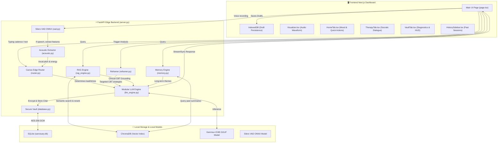

# 🌿 Sanctuary 3.0: Comprehensive Architecture & System Overview

Sanctuary 3.0 is a next-generation, local-first, highly secure **Socratic Cognitive Behavioral Therapy (CBT) Journaling and Assistant Platform**. It marries advanced cognitive computing architectures with state-of-the-art multimodal biometrics and strict user-privacy protocols to deliver clinical-grade therapeutic interactions completely on the edge.

---

## 🏗️ High-Level System Architecture

Sanctuary operates on a strict **decentralized, local-first hybrid architecture**. The frontend client collects typing biometrics and voice streams, while the FastAPI edge backend performs lightweight local heuristics, runs voice activity detection, performs semantic vector database searches, and operates a quantized local LLM for CBT reasoning.



---

## ⚡ Backend Cognitive & Biometric Engine

The backend of Sanctuary is engineered for high performance, edge inference efficiency, and deep clinical efficacy. Below is a detailed breakdown of the backend components:

| Component | File | Core Responsibility | Key Technologies & Algorithms |
| :--- | :--- | :--- | :--- |
| **Edge Server** | [server.py](file:///home/heril/Gemm/gemma4/backend/server.py) | Coordinates all REST/SSE endpoints; orchestrates streaming pipelines. | FastAPI, Uvicorn, SSE, multiprocessing semaphores |
| **Cactus Edge Router** | [router.py](file:///home/heril/Gemm/gemma4/backend/router.py) | Dynamic heuristic router evaluating cognitive load and emotional distress to route tasks. | Heuristics based on text complexity, typing intervals, and acoustic pitch variance |
| **Secure Vault** | [database.py](file:///home/heril/Gemm/gemma4/backend/database.py) | Encrypted SQLite storage for chat history, sessions, and user ratings. | AES-256-GCM authenticated encryption, `cryptography` library, Python `sqlite3` |
| **Cognitive Reframer** | [reframer.py](file:///home/heril/Gemm/gemma4/backend/reframer.py) | Parses journal text to detect 6 primary cognitive distortions and suggests corrective Socratic prompts. | Advanced Regex engines mapping to distinct CBT clinical response guides |
| **RAG Engine** | [rag_engine.py](file:///home/heril/Gemm/gemma4/backend/rag_engine.py) | Grounding query vector retrieval containing clinical CBT protocols and treatment templates. | ChromaDB, `all-MiniLM-L6-v2` embeddings, `cross-encoder/ms-marco-MiniLM-L-6-v2` reranker, Semantic Cache |
| **Memory Engine** | [memory.py](file:///home/heril/Gemm/gemma4/backend/memory.py) | Summarizes completed therapeutic chats and vectors past themes to provide context in new sessions. | ChromaDB vector summaries database, LLM session summarizers, chronological retrievals |
| **Modular LLM Engine** | [llm_engine.py](file:///home/heril/Gemm/gemma4/backend/llm_engine.py) | High-speed, local quantized model loader and streaming text generator. | `llama-cpp-python`, Min-P sampling (0.05-0.1), thread physical core mapping, HyDE (Hypothetical Document Embeddings) |
| **Voice Activity Detection** | [vad.py](file:///home/heril/Gemm/gemma4/backend/vad.py) | Local speech detection filtering noise and empty space before transcription. | Silero VAD, ONNX Runtime (`onnxruntime`), `librosa` |
| **Acoustic Analyzer** | [acoustic.py](file:///home/heril/Gemm/gemma4/backend/acoustic.py) | Extracts vocal pitch variance and sound energy from user audio recording. | Librosa (PIPTrack pitch tracking, Root-Mean-Square energy calculation) |

---

## 🎙️ Dynamic Multimodal Biometric Routing

The **Cactus Edge Router** analyzes three distinct real-time biometrics from the client device to ascertain the user's current cognitive/stress state.

```
                          [User User Input]
                                  │
         ┌────────────────────────┼────────────────────────┐
         ▼                        ▼                        ▼
[Text Complexity]         [Typing Cadence]        [Acoustic Biomarkers]
Word Count > 20           Latency > 400ms         Pitch > 220Hz (Anxiety)
      │                           │               Energy < 0.01 (Depression)
      │                           │                        │
      └───────────────────────────┼────────────────────────┘
                                  ▼
                        [Heuristic Evaluation]
                                  │
                 ┌────────────────┴────────────────┐
                 ▼ (Stress Detected)               ▼ (Stable/Minimal Input)
          [HEAVY CORE]                    [LIGHTWEIGHT LOCAL]
     Gemma-4 CBT Reasoning Engine      Brief, grounding response
```

1. **Text Complexity:** Analyzes word count (configured at `Config.TEXT_COMPLEXITY_WORD_COUNT = 20`). Long inputs denote expressive detailing, which immediately triggers full reasoning.
2. **Typing Cadence:** Tracks physical keystroke intervals (`Config.TYPING_INTERVAL_STRESS_THRESHOLD = 400ms`). High latency/hesitation flags cognitive load or anxiety, indicating a high-stress state.
3. **Acoustic Biomarkers:** 
   - **Vocal Pitch:** Frequencies above `200Hz` / `220Hz` signal vocal strain or high emotional arousal (anxiety).
   - **Sound Energy:** RMS amplitude falling below `0.01` signals quiet, flat speech patterns, mapping to potential depressive states or fatigue.

---

## 🧘 Cognitive Distortion Detection & Reframing

The **Cognitive Reframer** maps linguistic indicators inside user entries to 6 main patterns of cognitive distortion:

*   **All-or-Nothing Thinking (`all_or_nothing`):** Uses absolute language (*"always"*, *"never"*, *"perfect"*, *"failure"*). The Socratic engine responds by asking for times when these absolutes didn't apply, helping users locate the "gray area".
*   **Catastrophizing (`catastrophizing`):** Spotlights worst-case scenario panic (*"terrible"*, *"disaster"*, *"can't stand"*). Socratic logic guides the user to rate the logical probability (1-100) and discuss internal coping resources.
*   **Should Statements (`should_statements`):** Identifies moralizing self-judgment (*"should"*, *"must"*, *"have to"*). Guidance prompts the user to soften rules into healthy personal preferences.
*   **Labeling (`labeling`):** Attaches overall self-deprecating words (*"loser"*, *"idiot"*, *"stupid"*). Encourages splitting the self from a single negative event.
*   **Mind Reading (`mind_reading`):** Assumes negative external views (*"they think"*, *"everyone hates"*). Invites concrete objective evaluation of evidence.
*   **Mental Filtering (`mental_filtering`):** Excludes positive occurrences (*"only"*, *"but"*, *"except"*). Invites the user to find a small positive detail that was filtered out.

---

## 🔍 Semantic RAG & Double-Loop Memory

Sanctuary implements a state-of-the-art **Retrieval-Augmented Generation (RAG)** pipeline integrated with long-term memory:

1.  **Semantic Vector Grounding:** Lazy-loads local clinical templates (CBT anxiety guides, depression intervention workflows, crisis resources) and seeds a comprehensive Kaggle clinical dataset.
2.  **Hypothetical Document Embeddings (HyDE):** If the input is classified as highly severe, the LLM first creates a hypothetical ideal therapy response, which is then used as the query vector to yield cleaner semantic results.
3.  **Cross-Encoder Reranking:** Raw candidates are scored and reordered via a lightweight local Cross-Encoder (`ms-marco-MiniLM-L-6-v2`) to prioritize relevant protocols.
4.  **Semantic Cache:** An in-memory cache intercepts vector queries to bypass heavy models on similar expressions.
5.  **Long-Term Memories Integration:** Every 5 turns, the backend triggers `memory.summarize_session`, vectorizing clinical themes and adding them to a separate ChromaDB summary collection. These past themes are retrieved and injected into the LLM system instructions during subsequent sessions for longitudinal continuity.

---

## 🖥️ Premium Next.js Frontend Client

The frontend is a fluid, high-fidelity React application using **Framer Motion** for animations and dynamic layouts.

```
       ┌───────────────────────────────┐
       │   Next.js Client (page.tsx)   │
       └──────────────┬────────────────┘
                      │ Tabs
     ┌────────────────┼────────────────┐
     ▼                ▼                ▼
┌───────────┐   ┌───────────┐    ┌───────────┐
│  HomeTab  │   │TherapyTab │    │ VaultTab  │
└───────────┘   └─────┬─────┘    └───────────┘
                      │
            ┌─────────┴─────────┐
            ▼                   ▼
    ┌───────────────┐   ┌───────────────┐
    │  Visualizer   │   │HistorySidebar │
    └───────────────┘   └───────────────┘
```

*   **Home Tab ([HomeTab.tsx](file:///home/heril/Gemm/gemma4/frontend/src/components/HomeTab.tsx)):** Features custom mood trackers with device haptics, starting points for clinical modules, quick navigation, and visual cards pointing to past journals.
*   **Therapy View ([TherapyTab.tsx](file:///home/heril/Gemm/gemma4/frontend/src/components/TherapyTab.tsx)):** Houses interactive Socratic chat interfaces. Highlights user inputs, displays detected cognitive distortion badges, renders Markdown, and maintains audio visualizers.
*   **Encrypted Vault ([VaultTab.tsx](file:///home/heril/Gemm/gemma4/frontend/src/components/VaultTab.tsx)):** Provides physical edge diagnostics: keystroke delay progress bars, live log stream updates, DB status indicators, and security confirmations.
*   **Visualizer ([Visualizer.tsx](file:///home/heril/Gemm/gemma4/frontend/src/components/Visualizer.tsx)):** Renders high-fidelity audio waves using HTML Canvas and Web Audio API nodes in real-time when the microphone is recording.
*   **History Sidebar ([HistorySidebar.tsx](file:///home/heril/Gemm/gemma4/frontend/src/components/HistorySidebar.tsx)):** Pulls encrypted session lists, loading text snippets and dates, allowing immediate hot-swapping between current and historical chats.

---

## 📈 Fine-Tuning & Model Training Pipeline

To achieve optimal CBT reasoning performance on an edge device, Sanctuary features a customized **Unsloth Fine-Tuning and compiler script** (`train_unsloth.py`) and a **Federated Learning** aggregation system:

```
[Pruned Empathetic Dialogues] (300 rows) ────────┐
                                                ├─► [SFT Trainer via Unsloth] ─► [LoRA CBT Adapter (Rank 32)]
[CBT Cognitive Distortion Therapist Responses] ─┘          │
                                                           ▼
                                                [Pure HuggingFace Fusion] (Base + LoRA)
                                                           │
                                                           ▼
                                                [Llama.cpp q8_0 GGUF Compiling]
```

### 1. The Core Fine-Tuning Pipeline (`train_unsloth.py`)
*   **Model Base:** Fine-tuned from `unsloth/gemma-4-e4b-it` (Gemma 4 Edge 4-Billion Parameter Instruct Model).
*   **PEFT Adapter Configuration:** Rank-Stabilized LoRA (`use_rslora=True`) with rank $r=32$ and $\alpha=64$ applied to all attention and projection layers.
*   **Optimized Dataset Diet:** Blends therapist responses to cognitive distortions for rigid CBT logic, alongside a strictly pruned set of Empathetic Dialogues (capped at 300 rows) to inject deep emotional validation without diluting therapeutic structure.
*   **Plateau Protection:** Uses `neftune_noise_alpha=5` to prevent formatting overfitting and `paged_adamw_8bit` optimizer to prevent VRAM spikes.
*   **Quantized Compilation:** Bypasses basic wrappers to load base model FP16 weights, fuses PEFT adapters mathematically, saves the raw directory, clones `llama.cpp` directly, and compiles the model down to `q8_0` GGUF format (`sanctuary_cbt_final-q8_0.gguf`).

### 2. Federated Learning Infrastructure (`backend/federated/`)
*   **FedAvg Aggregator (`aggregator.py`):** Implements the classic Federated Averaging algorithm to merge LoRA adapter weight tensors (`adapter_model.bin`) from multiple distinct users on the local intranet, preserving strict client data separation.
*   **Client Sync & Utils (`client_sync.py`, `client_utils.py`):** Manages local model status, calculates validation metrics, and pushes/pulls lightweight adapter checkpoints to allow Sanctuary instances to learn from collective user behaviors anonymously.

---

## 🔒 Absolute Privacy & Local Data Compliance

All user telemetry, voice segments, keys, database entries, and generative loops stay entirely within the user's host environment.
- **Biometric Privacy:** Voice VAD and pitch analysis are processed locally; transcription operates entirely on-device (via local Whisper).
- **Data Compliance:** SQLite data files and model cache instances are shielded behind military-grade AES-256 GCM authenticated encryption keys stored locally. No cloud telemetry or diagnostics leave this device.
